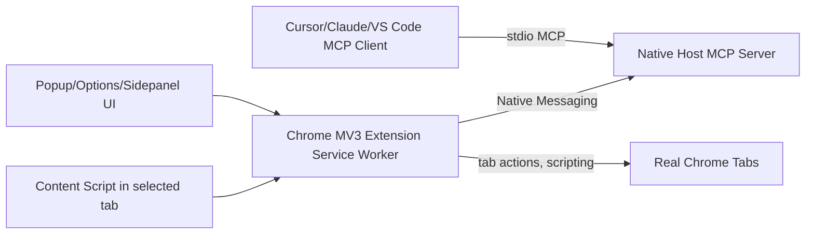

# Architecture

- Primary transport: Native Messaging (extension ↔ local host).
- MCP: stdio endpoint in native host for any MCP-compatible client.
- Optional HTTP mode: localhost-only (127.0.0.1), origin-checked, token-gated, disabled by default.
- Security defaults: deny-by-default, read-only toggle, per-action approvals, domain allowlist, emergency stop.
